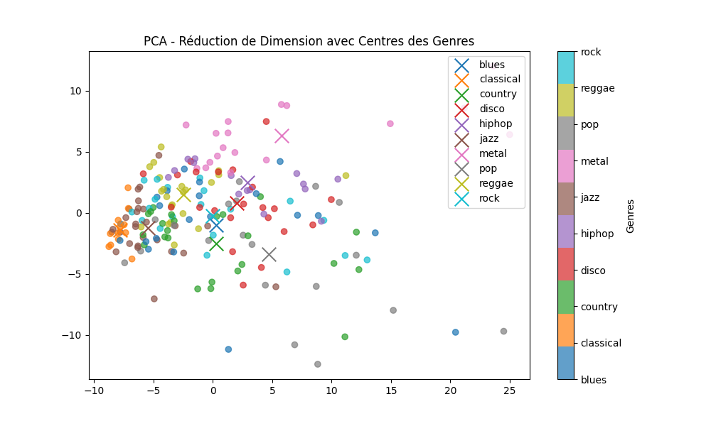
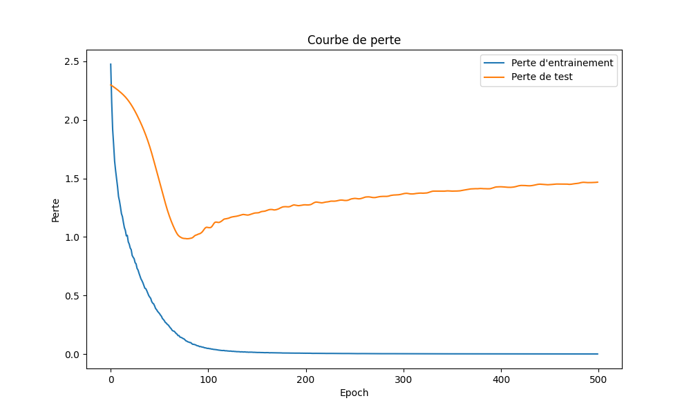
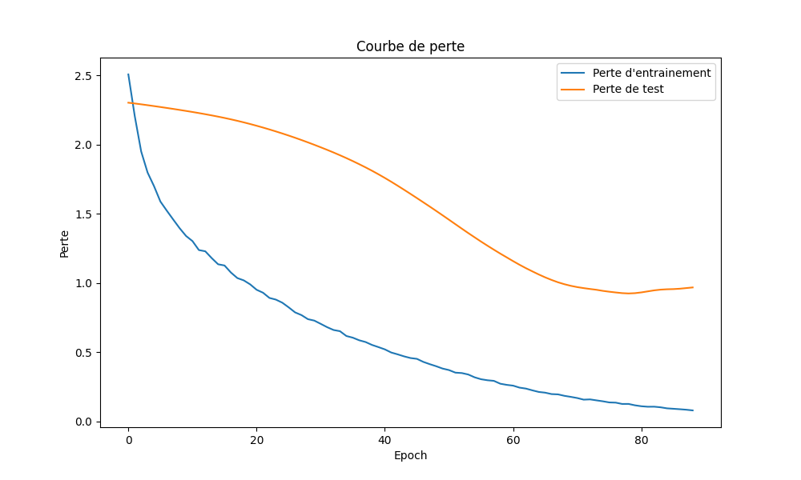
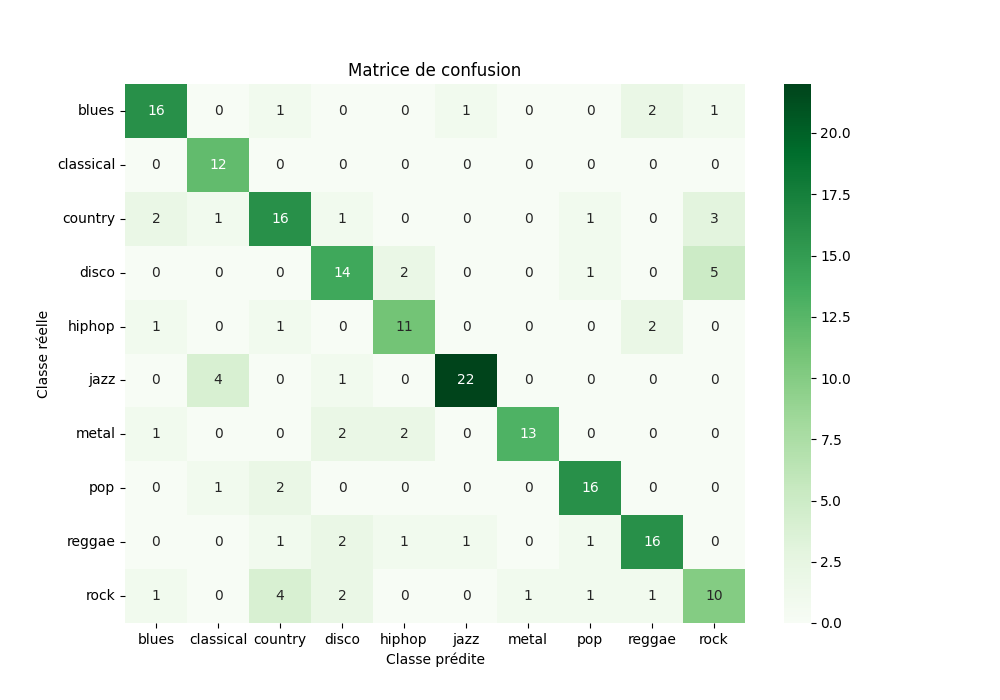
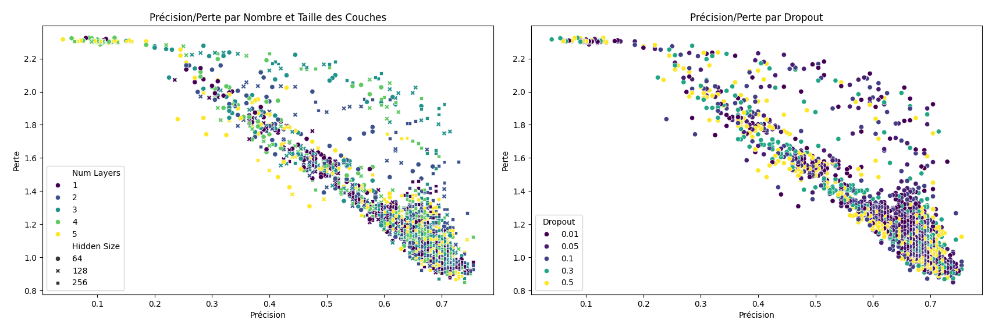
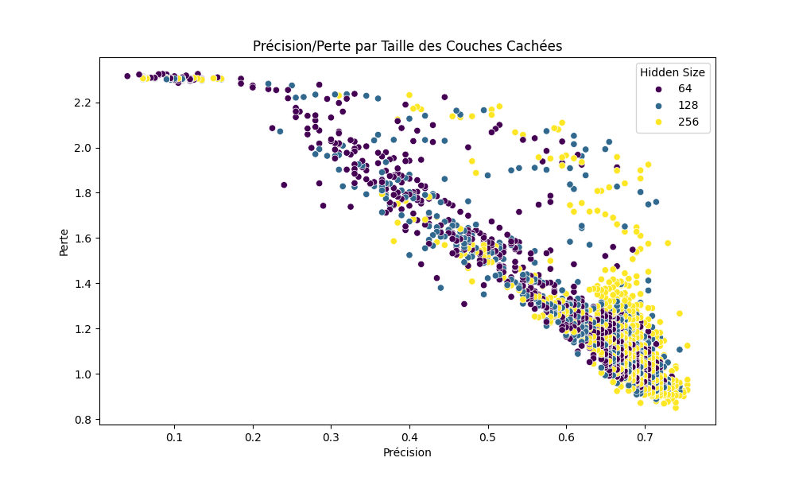
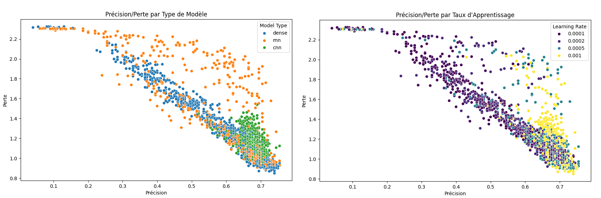

# DATA832 - Classification de genres musicaux

_Mathieu - Louna_

GitHub : [juste ici](https://github.com/Mathieeeu/data832_projet)

-------------------------------------------

## Extraction des caractéristiques audio

Notre but est de créer un modéle capable de déterminer le genre d'une musique. Notre dataset se compose de 1 000 morceaux de 10 genres différents : blues, classical, country, disco, hiphop, jazz, métal, pop, reggae et rock (100 pistes par genre).

Le dataset se décompose en deux parties : une première composé des 1 000 fichiers audio et une seconde de fichiers csv. Ces derniers contiennent des caractéristiques extraites des fichiers audio. Cependant, ces caractéristiques ne nous permettaient pas d'obtenir de résultat viable, nous avons donc décidé de ne pas les utiliser et d'en extraire nous même.

Pour ce faire, nous avons utilisé la librairie Librosa dans le script `feature_extraction.py`. Les caractéristiques que nous avons extraites sont les suivantes :

- mfccs : coefficients cepstraux en fréquence Mel (en anglais Mel-frequency cepstral coefficients)
- chroma : chromagramme de la piste audio, représentant l'énergie des différentes classes de hauteur chromatique au fil du temps (12 classes : Do, Do#, Re, Re#, Mi, Fa, Fa#, Sol, Sol#, La, La#, Si)
- spectral_contrast : contraste spectral, qui mesure la différence entre les pics et les creux du spectre audio
- tempo : le tempo de la piste audio, en bpm
- tonnetz : c'est une représentation des relations tonales et harmoniques dans la musique (tonnetz = réseau tonal en allemand)
- mel_spectrogram : représentation visuelle de l'énergie d'un signal audio dans le domaine temps-fréquence, mais avec une transformation qui reflète la perception humaine des fréquences (grave à aiguë, mesurée en Mel)

L'extraction de ces caractéristiques peut prendre un certain temps, en fonction de la puissance de la machine utilisée. C'est pourquoi nous l'avons enregistré en csv et stocké dans le dossier `data` du dépôt. Il est possible de le regénérer en lançant le script `feature_extraction.py` et en précisant un nouveau nom du fichier csv et le répertoire où sont stockées les données audio. Dans sa version actuelle (la plus complète possible), 174 caractéristiques sont extraites pour chaque morceau de musique (principalement des spectrogrammes).



Pour pouvoir visualiser la répartition des genres musicaux, nous avons fait une première visualisation grâce à une réduction de dimensions avec une PCA (Principal Component Analysis). Sur ce graphique, on peut remarquer que certains genres musicaux ont des caractéristiques proches et se mélangent (ex : dispo et hiphop) et d'autres sont éloignés et isolés (ex : classique et métal). On peut aussi voir que certains genres sont très dispersés parmis les autres (ex : blues et rock).

## Différentes approches

Nous avons testé différentes approches et librairies afin de trouver le meilleur modèle de prédiction possible.

### Keras

Au départ, nous avons essayé d'utiliser Keras pour faire un modèle de réseau de neurones récurrent (RNN) avec LSTM (Long Short-Term Memory). Ce modèle a donné des résultats très médiocres (environ 50% à 60% de précision). Nous avons donc décidé de changer d'approche et de tester une autre librairie, PyTorch.

### Torch

En faisant des recherches sur internet, nous avons remarqué que PyTorch était utilisé par de nombreux projets de machine learning. Nous avons donc décidé d'essayer et les résultats étaient bien meilleurs qu'avec Keras. Notre projet final utilise donc PyTorch.

## Fonctionnement du projet

La totalité du code du projet est contenue dans le dossier `src`. Le script principal est `main.py`, qui permet de lancer l'extraction des caractéristiques, l'entraînement du modèle et l'affichage des résultats pour un jeu d'hyperparamètres donné (hardcodé dans le script).

Premièrement, les données sont préparées pour être traitées grâce au script `preprocess.py` qui encode les étiquettes, normalise les caractéristiques et divise les données en ensembles d'entraînement et de test. Pour ce faire, nous avons utilisé la librairie `sklearn`.

Ensuite, le script `training.py` permet d'entraîner le modèle de classification. Ce script utilise des modèles de réseaux de neurones de différents types définies dans `models.py` :

- Réseau Dense (DNN) : un réseau de neurones classique avec plusieurs couches cachées.
- Réseau de neurones convolutif (CNN) : un réseau de neurones qui utilise des couches de convolution pour extraire des caractéristiques locales des données d'entrée.
- Réseau de neurones récurrent (RNN) : un réseau de neurones qui utilise des connexions récurrentes pour traiter des séquences de données.

L'entrainement prend en entrée plusieurs paramètres :

- Les données d'entrainement et de test (`X_train`, `X_test`, `y_train`, `y_test`)
- Le type de modèle à utiliser (`model_type`, "cnn", "dense" ou "rnn")
- La taille des couches cachées (`hidden_size`)
- Le nombre de couches cachées (`num_layers`)
- Le taux de dropout (`dropout`), qui consiste à ignorer aléatoirement certains neurones pendant l'entraînement pour éviter le sur-apprentissage
- Le taux d'apprentissage (`learning_rate`), qui détermine la vitesse à laquelle le modèle apprend
- Le nombre d'époques (`num_epochs`)
- Des paramètres pour l'arrêt précoce de l'entrainement en cas de sur-apprentissage (`early_stopping`, `patience`)

Une fois l'entrainement du modèle terminé, la fonction `train_model` renvoie le modèle entrainé et les listes de pertes lors du train et de la validation. Ces listes sont ensuite utilisées dans le `main.py` pour tracer les courbes de pertes et de précision. La courbe obtenue est alors la suivante : 



On remarque ici un fort sur-apprentissage, c'est ce qui nous a poussé à utiliser un mécanisme d'arret précoce de l'entrainement. Désormais, dès que les pertes n'évoluent plus (ou augmentent), l'entrainement s'arrête rapidement. Cela permet de gagner du temps et d'avoir un meilleur modèle.



Enfin, le script `main.py` fait l'évaluation du modèle sur l'ensemble de test et affiche la matrice de confusion ainsi que les performances du modèle (précision, rappel, F1-score, précision globale). Les résultats obtentus sont les suivants :

```
Précision: 0.755
Report:
                precision    recall  f1-score   support
 
        blues       0.89      0.76      0.82        21
    classical       0.80      1.00      0.89        12
      country       0.68      0.71      0.69        24
        disco       0.67      0.64      0.65        22
       hiphop       0.63      0.80      0.71        15
         jazz       0.89      0.93      0.91        27
        metal       0.87      0.72      0.79        18
          pop       0.75      0.79      0.77        19
       reggae       0.80      0.73      0.76        22
         rock       0.58      0.55      0.56        20
 
     accuracy                           0.76       200
    macro avg       0.76      0.76      0.76       200
 weighted avg       0.76      0.76      0.75       200
```



Dans l'ensemble, le modèle fonctionne bien, mais il y a surement encore des améliorations possibles. Nous avons essayé de trouver un modèle plus performant, mais nous n'en avons pas trouvé de meilleur que celui-ci, qui obtient systématiquement entre 70% et 76% de précision (ce qui est assez proche des résultats obtenus par d'autres projets similaires).

## Optimisation des hyperparamètres

Dans le but d'améliorer les performances du modèle, nous avons essayé d'optimiser les hyperparamètres. Pour cela, nous avons utilisé la `ParameterGrid` de `sklearn`, qui permet de tester différentes combinaisons d'hyperparamètres. Nous avons testé au total 2700 combinaisons de plusieurs types de réseaux de neurones (RNN, CNN, DNN), de tailles et de nombres de couches cachées, de taux de dropout, de taux d'apprentissage et de nombre d'époques et avons enregistré les résultats dans un fichier CSV.

Grâce aux données obtenues, il est possible de tracer des graphiques pour voir les paramètres qui ont le plus d'impact sur les résultats. 



Par exemple, sur ces premiers graphiques, on peut voir que le nombre de couches cachées et le taux de dropout n'ont qu'un faible impact sur la précision et que les modèles ayant 256 neurones par couche semblent avoir de meilleures performances, ce qui se confirme dans le graphique ci-dessous.



Pour finir, les deux graphiques ci-dessous montrent les résultats obtenus en fonction du type de réseau et du taux d'apprentissage.



On peut y voir que le type de réseau a un impact important sur les résultats. En effet, les meilleurs résultats sont obtenus avec des réseaux récurrents et denses (malgré le fait que les performances les moins bonnes le soient également). On voit aussi que le learning rate semble avoir un véritable impact mais il est difficile de savoir lequel est le meilleur.

Le modèle que nous avons choisi d'utiliser dans notre projet est donc un réseau de neurones récurrent (RNN) avec 256 neurones par couche, 2 couches cachées, un taux de dropout de 30% et un taux d'apprentissage de 0.0005. Ce modèle est celui qui a donné les meilleurs résultats lors de nos tests, ce qui nous a permis de passer de 68% à 76% de précision dans les meilleurs cas. L'ensemble des résultats de la phase d'optimisation des hyperparamètres est disponible dans le fichier `data/hyperparameters_results.csv` sur le dépôt du projet car il a été très long à générer (environ 2 heures).

## Appel à un "ami"

Nous avons principalement utilisé l'IA (essentiellement Le Chat de Mistral) pour résoudre des problèmes configurations de paramètres.

Le premier prompt que nous avons fait concerne la matrice de confusion (modèle utilisant les csv fournis).

```prompt
J'ai une erreur de dimension avec la matrice de confusion
```

Nous savions que l'erreur venait d'un problème de dimension (2D au lieu de 3D) et l'IA nous a permit de gagner un peu temps. Nous aurions résolu le problème en cherchant par tatonnement et sur les forums mais cela ne nous aurait pas forcément apporté beaucoup. L'erreur venait bien de là et à été résolu en rajoutant une dimension à nos ensembles de test et de train.

```python
X_train = np.expand_dims(X_train, axis=-1)  # (samples, 58, 1)
X_test = np.expand_dims(X_test, axis=-1)
```

Nous avons également rencontré des erreurs avec SVM et XGBoost. Nous avons demandé à l'IA de nous aider à les résoudre. Nous y avons appris que SVM ne pouvait pas être utilisé avec des données non numériques et que nos paramètres n'étaient pas adaptés pour XGBoost.

Enfin, comme notre but est de trouver le modèle avec la meilleure précision et que nous n'arrivions pas à dépasser 65%, nous avons essayé de trouver un modèle plus performant. Nous avons donc fait des recherches et demandé des explications/conseils à l'IA pour comprendre le fonctionnement des différents types de réseaux de neurones que nous avons utilisé (RNN, CNN, DNN).


## Améliorations possibles

Les améliorations possibles consistent principalement à l'optimisation du modèle. Nous avons déjà essayé d'optimiser au maximum les hyperparamètres mais il est certainement possible d'encore augmenter les performances du modèle. Nous avons aussi essayé d'utiliser des modèles plus complexes (comme les réseaux de neurones convolutifs) mais ils n'ont pas donné de meilleurs résultats que les RNN. Nous pensons cependant qu'il est possible que d'autres types de réseaux de neurones soient plus performants.

Il serait également judicieux d'augmenter le nombre de données d'entrainement du dataset. En effet, 100 morceaux par genre est un peu faible et il serait intéressant d'en avoir beaucoup plus, pour améliorer l'entrainement et la précision du modèle.

Enfin, il serait intéressant de tester d'autres types de caractéristiques audio. Nous avons utilisé les caractéristiques les plus courantes mais il en existe d'autres qui pourraient être utilisées.

## Conclusion

Pour conclure, ce projet nous a permis de découvrir le fonctionnement de réseaux de neurones et de la classification audio. Nous avons été amenés à utiliser différentes librairies (Librosa, PyTorch, sklearn) et à en apprendre plus sur les différentes caractéristiques audio qui peuvent être analysées par un ordinateur. Nous avons également essayé d'optimiser au maximum les paramètres que nous utilisions pour faire le meilleur projet possible \:)
